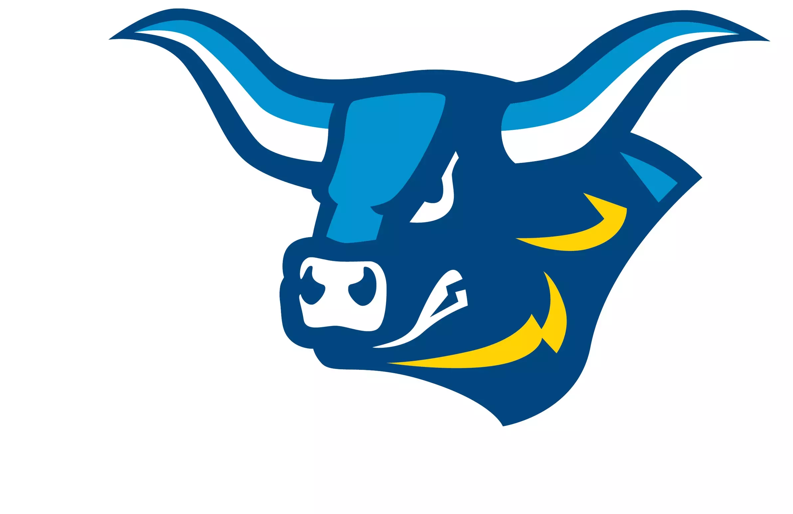

# AlfredGO

A mobile-first student portal for Alfred State College. Students can quickly find and access campus tools like email, registration, financial aid, dining, and more — all from one place.



## Features

- **Mobile-first design** — built for phones, works on desktop too
- **Real-time search** — filter tools instantly by name or keyword
- **Category tabs** — browse by Academics, Finance, Campus Life, Communication, or Support
- **10 campus tools** — direct links to the most-used student resources
- **Fast and lightweight** — vanilla HTML, CSS, and JavaScript, no frameworks

## Tools Included

| Tool | Category |
|---|---|
| Email (Outlook) | Communication |
| Degree Works | Academics |
| Registration | Academics |
| Class Schedule | Academics |
| Library Services | Academics |
| Financial Aid | Finance |
| Student Billing | Finance |
| Dining Services | Campus Life |
| Housing Portal | Campus Life |
| IT Help Desk | Support |

## Tech Stack

- **Frontend** — HTML5, CSS3, Vanilla JavaScript (ES6)
- **Backend** — Node.js, Express
- **Design** — Mobile-first, Inter font, CSS custom properties

## Running Locally

1. Clone the repo
   ```bash
   git clone https://github.com/jrd59501/alfredgo.git
   cd alfredgo
   ```

2. Install dependencies
   ```bash
   cd project
   npm install
   ```

3. Start the server
   ```bash
   node server/server.js
   ```

4. Open your browser to `http://localhost:3000`

## Project Structure

```
project/
├── public/
│   ├── index.html       # App shell
│   ├── styles.css       # Mobile-first styles
│   ├── app.js           # Search, filtering, card rendering
│   └── images/          # Logo and mascot assets
└── server/
    ├── server.js        # Express server
    └── data/
        └── tools.js     # Campus tool definitions
```

## Author

Justin Denny — Alfred State College
